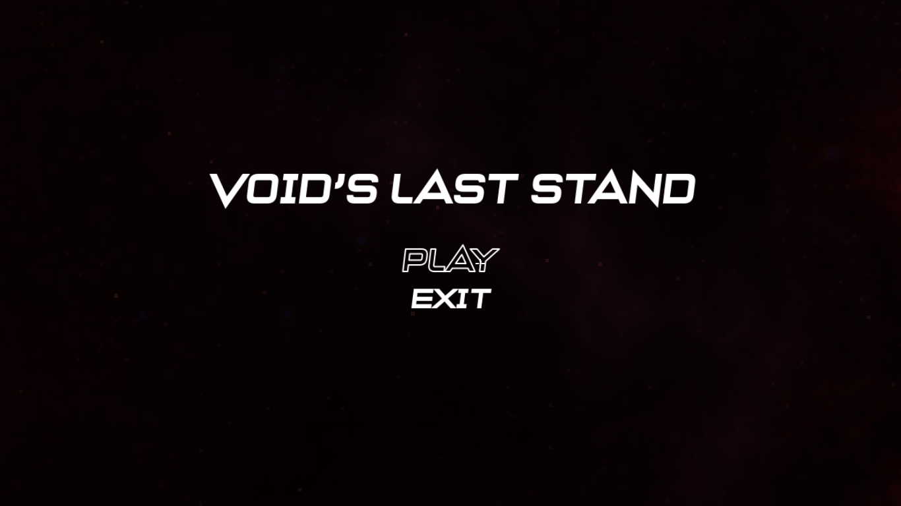
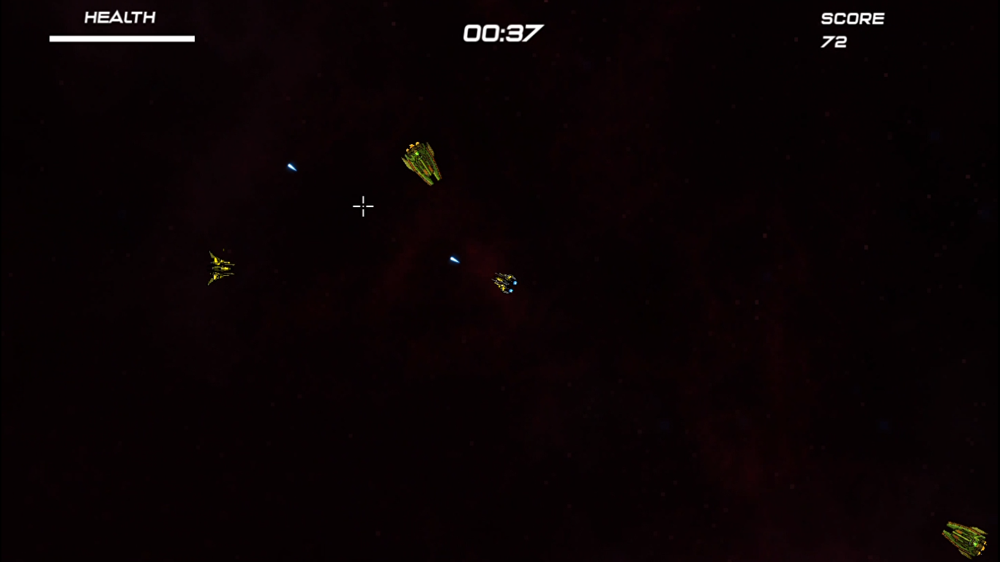
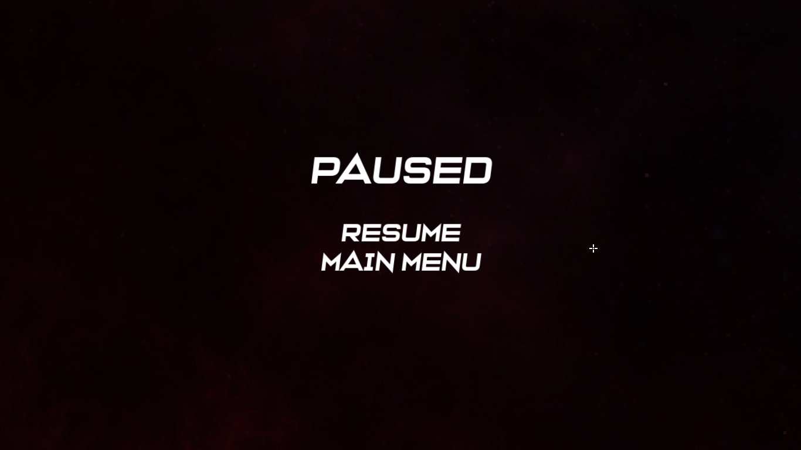

# VOID's LAST STAND

VOID's LAST STAND is a 2D top-down shooter game built using **SFML** (Simple and Fast Multimedia Library). The player must survive waves of enemies while managing their health, shooting accuracy, and evasion skills. The goal is to achieve the highest possible score by defeating enemies before being overrun.

---

## Features
- **Dynamic Gameplay**: Real-time movement, shooting, and enemy AI.
- **Player Mechanics**:
  - Precise mouse-controlled aiming.
  - Smooth 8-Direction movement clamped within game boundaries.
- **Enemies**:
  - Randomized spawn locations.
  - Collision detection with the player and other enemies.
  - Health and destructibility.
- **Laser-Based Attack Mechanic**:
  - Player can shoot bullets with customizable intervals.
- **Collision Detection**:
  - Collision detection Between Objects.
- **Audio**:
  - Laser firing sounds.
  - Enemy destruction sound effects.
  - Transition sound effects.
- **Game States**:
  - Main Menu (with play and exit buttons).
  - Game (with controls and Pause option with 'ESC').
  - Pause (with Resume and Main Menu buttons).
- **UI**:
  - Dynamic score display.
  - Timer to track survival duration.
  - Health bar and labels for clarity.

---

## Gameplay
1. **Main Menu**:
   - Click **Enter** to start the game.
   - Click **Escape** to quit.
2. **Controls**:
   - **Mouse Left-Click**: Shoot bullets.
   - **Mouse Movement**: Aim the player's weapon.
   - **Escape**: Pause or resume the game.
3. **Survival**:
   - Survive as long as possible by avoiding enemies and keeping your health above 0.
   - Shoot enemies to gain points.

---

## Installation and Usage
### Prerequisites
- **SFML**: Ensure SFML is installed on your system. [Install SFML](https://www.sfml-dev.org/download.php)
- **Compiler**: A C++ compiler supporting C++11 or later.

### Clone the repository:
   ```bash
   git clone git@github.com:Abubakkar-Khan/VOID-S_LAST_STAND.git
   ```


---

## File Structure
```
VOID's LAST STAND
├── SFML 1/
│   ├── Textures/
│   │   ├── ship2.png (Player, Enemy 1)
│   │   ├── enemy3.png (Enemy 2)
│   │   ├── 11.png (Bullet)
│   │   ├── purple.png (Background)
│   │   └── aim.png (cursor)
│   ├── Sounds/
│   │   ├── laser.wav
│   │   ├── Transition_3.wav
│   │   ├── gameover.mp3
│   │   └── explode.mp3
│   ├── Fonts/
│   │   └── V.ttf
│   ├── main.cpp
│   ├── Player.h / Player.cpp
│   ├── Bullet.h / Bullet.cpp
│   ├── Enemy.h / Enemy.cpp
│   ├── Entity.h / Entity.cpp
│   ├── HealthBar.h / HealthBar.cpp
│   ├── Collider.h / Collider.cpp
│   ├── Animation.h / Animation.cpp
├── README.md
└── LICENSE
```

---

## Architecture
The following class diagram illustrates the relationships and dependencies between key components of the game:


---

## Dependencies
- **SFML** (2.5.1 or later):
  - Graphics, Audio, and Window modules.

---

## Contributions
Contributions are welcome! Feel free to fork the repository and submit pull requests for improvements, bug fixes, or new features.

---

## License
This project is licensed under the MIT License. See the [LICENSE](LICENSE) file for details.

---

## Screenshots

### Gameplay


### Main Menu


### Pause Screen

